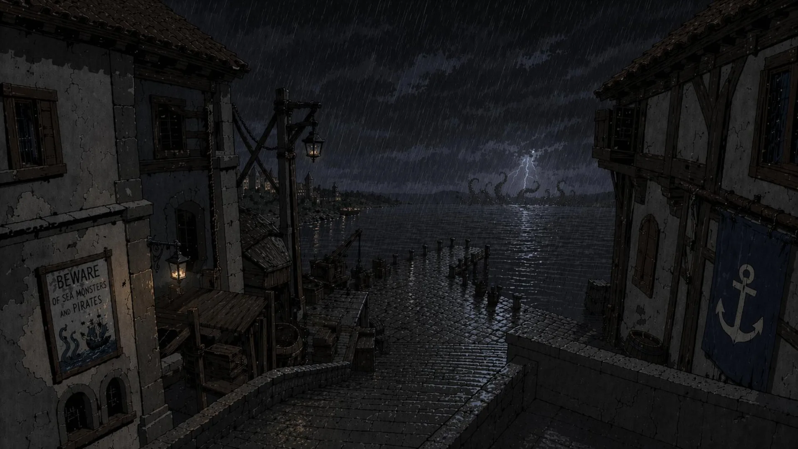
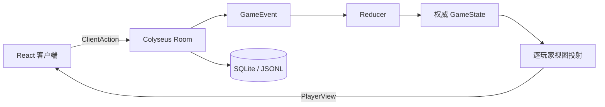

# 险恶疑航 Web · Feed the Kraken

> 一个面向 5–11 人熟人局的非官方 Web 桌游实现。
> 服务端维护权威状态，为每位玩家投射独立私密视图；游戏讨论请配合外部语音。

<p align="center">
  
</p>

## 项目状态

本项目处于开发阶段，当前是**简化海图核心规则版**，不是对原版桌游的完整数字复刻。

| 能力                                       | 状态   |
| ------------------------------------------ | ------ |
| 5–11 人创建、加入和开始游戏                | 已实现 |
| 快速 / 漫长航行                            | 已实现 |
| 任命、叛变、选牌、跳船和下班轮换           | 已实现 |
| 醉酒、缴械、武装、美人鱼、望远镜、邪教起义 | 已实现 |
| 搜查、献祭、鞭笞、割舌和补给线             | 已实现 |
| 皈依、武器库、邪教船舱搜查                 | 已实现 |
| 逐玩家隐藏信息与游客身份重连               | 已实现 |
| 原版逐格箭头海图                           | 未实现 |
| 22 张角色异能                              | 未实现 |
| 进程重启后恢复进行中的牌局                 | 未实现 |
| 内置语音、观战、复盘和 PWA                 | 未实现 |

当前海图使用简化坐标规则：蓝 / 红 / 黄航行牌分别向水手、海盗和克拉肯方向推进。六边形棋盘只负责呈现当前逻辑状态，不代表原版地图拓扑。完整差异见[规则与实现对照](docs/2_规则与实现对照.md)。

## 主要特点

- **服务端权威**：规则、牌堆、投票和胜负均由 Colyseus 房间处理。
- **私密视图投射**：客户端只接收当前玩家有权看到的 `PlayerView`，不会获取完整 `GameState`。
- **事件驱动状态**：合法动作产生递增 `GameEvent`，再由 reducer 更新游戏状态。
- **动作事务与幂等**：同一动作不会重复执行，多事件动作失败时回滚内存状态。
- **断线恢复**：房间仍存活时，可使用本地保存的玩家凭据恢复身份。
- **响应式界面**：支持桌面与窄屏浏览器，使用仓库内航海主题素材。
- **低运维架构**：适合单进程、单副本和熟人局规模，不预设 Redis 或多服务集群。

## 技术栈

| 层级     | 技术                                              |
| -------- | ------------------------------------------------- |
| 前端     | React 19、Vite 8、TypeScript、Zustand、原生 CSS   |
| 实时通信 | Colyseus 0.17、WebSocket                          |
| 服务端   | Node.js、Express 5、Zod                           |
| 持久化   | better-sqlite3；不可用时降级为 JSONL              |
| 工程     | pnpm workspace、TypeScript 6、Node.js test runner |



## 快速开始

### 环境要求

- Node.js 22.12+
- pnpm 9+

### 安装与启动

```bash
git clone https://github.com/DamianD1cky/Feed-the-Kraken.git
cd Feed-the-Kraken
pnpm install
pnpm dev
```

启动后访问：

- 前端：<http://localhost:5173>
- 服务端：<http://localhost:2567>
- 健康检查：<http://localhost:2567/api/health>

也可以分别启动：

```bash
pnpm --filter @feed/server dev
pnpm --filter @feed/client dev
```

### 本地多人联调

1. 打开多个浏览器标签页。
2. 第一页创建房间并记下房间号。
3. 其他页面选择「凭房间号登船」，以新玩家身份加入。
4. 至少 5 人后由房主开始游戏。
5. 7 人局可选择快速或漫长航行；5–6 人使用快速航行，8–11 人使用漫长航行。

活动标签页使用 `sessionStorage` 隔离身份；`localStorage` 只保留同一房间最近一次持久身份。如果同一浏览器在同一房间模拟多个玩家，关闭全部标签后无法分别自动恢复所有身份。

## 常用命令

```bash
# 类型检查
pnpm typecheck

# 服务端测试
pnpm test

# 构建所有 workspace 包
pnpm build

# 服务端运行时冒烟测试（需要先启动服务端）
node scripts/smoke-game.mjs 5 quick
node scripts/smoke-game.mjs 11 long
```

现有测试覆盖阵营配比、叛变、航行、关键牌效、隐藏信息投射、重连令牌、动作幂等、回洗牌序和事务失败回滚。自动模拟能够验证流程到达终局，但不能替代真实朋友局、弱网和移动端测试。

## 配置

| 环境变量                   | 默认值                               | 用途                              |
| -------------------------- | ------------------------------------ | --------------------------------- |
| `PORT`                     | `2567`                               | 服务端监听端口                    |
| `VITE_SERVER_URL`          | 当前页面主机的 `ws(s)://<host>:2567` | 前端连接的完整 WebSocket 地址     |
| `DATABASE_PATH`            | `./data/kraken.sqlite`               | SQLite 文件路径                   |
| `RECONNECT_SESSION_TTL_MS` | 7 天                                 | 重连凭据有效期                    |
| `ROOM_IDLE_TTL_MS`         | 24 小时                              | 无连接房间的保留时间              |
| `FTK_DEBUG`                | 关闭                                 | 设置为 `1` 启用动作与事件诊断日志 |

`VITE_SERVER_URL` 是构建时变量。HTTPS 页面必须连接 `wss://` 地址，修改变量后需要重新构建前端。

## 存储与恢复边界

事件优先写入 SQLite；`better-sqlite3` 不可用时，服务端会打印警告并回退到 `events.jsonl`。JSONL 不提供数据库级事务或掉电原子性，不能视为 SQLite 的等价替代。

目前持久化内容是事件记录，不是完整的可恢复房间：

- 玩家会话、内存房间和已处理动作集合尚未持久化。
- 服务端进程重启、热更新或重新部署会使进行中的房间失效。
- 浏览器中的重连凭据只能恢复仍存在于同一服务端进程中的房间。
- 事件文件包含完整私密信息，不应作为公开复盘文件分发。

## 部署

当前架构必须运行在支持常驻 WebSocket 和持久磁盘的**单副本**服务上，不适合直接部署为无状态 Serverless Function。

- 固定朋友约局、愿意安装组网客户端：可在个人电脑上按需运行，并通过虚拟组网访问。
- 希望分享网址即可加入：建议使用单台云服务器同时托管静态前端、Colyseus 和 SQLite。
- Vercel 只能托管前端；服务端仍需 Railway、Render、Fly.io 或自有服务器。

具体方案：

- [部署方案选型：云服务器、个人电脑与 P2P](docs/5_部署方案选型.md)
- [Vercel 前端 + Railway 服务端](docs/4_Vercel部署.md)

## 仓库结构

```text
.
├── assets/                  # 原始图片、模型、视频与规则资料
├── docs/                    # 架构、规则、验证与部署文档
├── packages/
│   ├── client/              # React / Vite 客户端
│   ├── server/              # Colyseus 权威服务端
│   └── shared/              # 协议类型、规则数据与运行时校验
├── scripts/
│   ├── prepare-assets.mjs   # 生成前端 WebP 与标题字体子集
│   └── smoke-game.mjs       # 真实 WebSocket 自动对局
├── pnpm-workspace.yaml
└── package.json
```

## 文档

1. [架构与技术现状](docs/1_架构与技术现状.md)
2. [规则与实现对照](docs/2_规则与实现对照.md)
3. [开发与验证](docs/3_开发与验证.md)
4. [Vercel 部署](docs/4_Vercel部署.md)
5. [部署方案选型](docs/5_部署方案选型.md)

## Roadmap

优先级按当前风险排序：

1. 建模原版逐格箭头海图并验证快速 / 漫长航行。
2. 实现房间快照、事件重放、会话和幂等元数据恢复。
3. 增加真实 SQLite、弱网和移动端验收。
4. 补全公共枪池和极端库存规则。
5. 在获得完整卡文并确认版权边界后实现角色异能。
6. 完善部署产物、健康检查、监控和备份。

## 参与贡献

欢迎通过 Issue 讨论规则差异、信息泄露风险、移动端体验和部署问题，也欢迎提交聚焦的 Pull Request。

提交前请运行：

```bash
pnpm typecheck
pnpm test
pnpm build
```

修改游戏规则时，请同时更新：

- `packages/shared/src/rules.ts` 或相关协议类型；
- 服务端 reducer / room 行为；
- 隐藏信息投射测试；
- `docs/2_规则与实现对照.md`。

安全相关问题，特别是隐藏阵营、手牌、令牌或跨玩家视图泄露，请不要直接公开可利用细节；在仓库正式配置安全报告渠道前，请先通过仓库维护者的 GitHub 联系方式沟通。

## 许可与版权

本仓库采用分层许可，**源码开源不代表美术资源可复用**：

- 原创程序代码采用 [MIT License](LICENSE)。
- `packages/client/public/fonts/` 中的标题字体是 Noto Serif SC 的子集，遵循 [SIL Open Font License 1.1](packages/client/public/fonts/OFL.txt)。
- `assets/picture/`、`assets/models/`、`assets/video/` 及其在 `packages/client/public/art/` 中的运行时版本由 DamianD1cky 保留全部权利，详见[美术资源许可](assets/LICENSE.md)。
- 美术资源仅允许为本地评估或参与本项目贡献而运行未修改副本；未经书面许可，不得提取、复用、修改、再分发、转授权、销售、公开部署、用于其他项目或产品，也不得用于数据集或机器学习系统。

- `Feed the Kraken`、原版规则、名称、角色、机制表达和相关知识产权归其各自权利人所有。
- 本项目与 Funtails GmbH、Spiel Instabil 及原作发行方无隶属或授权关系。
- `assets/准备/` 中的原版规则书、中文整理及其他参考资料不适用 MIT License，也不属于原创美术许可覆盖范围；其权利归各自作者和权利人所有。
- 本项目不得被表述为官方版本，也不提供任何商用授权保证。

在公开仓库前，仍应确认 `assets/准备/` 中第三方规则资料是否具有公开再分发许可；无法确认时，应将其移出公开仓库。许可声明不代替法律意见。
