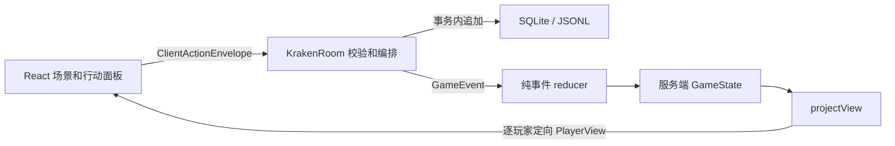

# 1. 架构与技术现状

核对日期：2026-09-19。本文描述仓库已经实现的行为；计划项放在末尾。阅读顺序：[规则对照](2_规则与实现对照.md) → [开发与验证](3_开发与验证.md)。

## 项目定位

5–11 人熟人局的 Web 桌游，采用单 Node.js 进程、服务端权威状态、逐玩家私密视图。当前支持默认六边形航线下的完整核心航行流程。原版逐格箭头海图、22 张角色异能、内置语音与进程重启恢复尚未完成。

原技术规格中的 React 18、Vite 5、Tailwind、shadcn/ui、Colyseus 0.15、Docker/Caddy 目录以及多张数据库表均不是当前实现。不要据旧规格排查环境或部署。

## 实际技术栈

| 层       | 当前依赖 / 实现                                       |
| -------- | ----------------------------------------------------- |
| 工作区   | pnpm 9.15.9 workspace、TypeScript 6                   |
| 前端     | React 19、Vite 8、Zustand 5、原生 CSS                 |
| 实时连接 | Colyseus 0.17、`@colyseus/sdk` 0.17                   |
| HTTP     | Express 5、`@colyseus/tools`                          |
| 输入校验 | Zod 4，仅客户端动作 envelope / action 有运行时 schema |
| 持久化   | better-sqlite3 12；不可用时回退 JSONL                 |
| 测试     | Node.js test runner + tsx；真实 SDK 冒烟脚本          |
| 当前协议 | `PROTOCOL_VERSION = 7`，定义在 `shared/src/types.ts`  |

React Router 在依赖中，但目前没有路径路由；大厅与房间由连接状态切换。`Role` 表示阵营身份（水手、海盗、领袖、教徒），不代表 22 张角色技能。

## 数据与控制流



`KrakenRoom` 负责连接生命周期、动作权限、阶段编排与随机决策；`engine/reducer.ts` 负责事件如何改变状态；`visibility/projectView.ts` 是内部状态到玩家视图的出口。Colyseus 公共 Schema 为空，完整状态不会通过 Schema 自动广播。

### 实际目录

```text
assets/                         原始图片、模型、视频和规则书
docs/                           维护中的技术和规则说明
scripts/
  prepare-assets.mjs            sharp / subset-font 生成运行时图片与字体
  smoke-game.mjs                 真实 WebSocket 多人流程
packages/shared/src/
  types.ts                      状态、协议、事件、视图类型
  rules.ts                      牌表、人数表、阈值和简化地图
  validators.ts                 动作运行时校验
packages/server/src/
  rooms/KrakenRoom.ts            房间生命周期和动作编排
  engine/{setup,reducer}.ts      初始化、候选人、事件归约
  visibility/projectView.ts      私密投射与公开日志
  session/tokens.ts              随机令牌、哈希、过期校验
  db/eventStore.ts               共享存储连接、事务
  debug.ts                      按需诊断日志
  index.ts                      HTTP 与房间注册
packages/client/
  public/art/                   优化后的 WebP
  src/scenes/                   Lobby、RoomView
  src/components/               ActionPanel、SeaChart、Rulebook
  src/{connection,store}.ts      SDK、恢复身份、连接状态
  src/labels.ts                 显示文案与图片 manifest
```

## 一致性与随机性

动作先校验协议、结构、连接绑定的玩家、房间和幂等键，再执行阶段权限判断。每个动作及其派生事件在同一存储事务中提交；事件分配递增 `seq` 并立即 reduce，提交完成后才投射和广播。失败时恢复动作前的状态、事件长度、`seq` 和已写幂等键。

SQLite 的 `match_events` 是当前唯一表。约束为 `(room_id, seq)` 与 `(room_id, player_id, action_id)` 唯一；同一动作只有首个事件携带 `action_id`。所有房间在进程内共享懒初始化的存储连接。

JSONL 在动作内缓冲所有事件，成功后一次 append；它不具备数据库事务与掉电原子性，磁盘故障可能留下尾部残行，不能等同于 SQLite。房间加入等生命周期路径也不应被概括成完整的可恢复事务系统。

开局 seed 决定阵营与初始牌序。回洗、日志混牌等后续随机决策使用新的随机输入，并把结果牌 ID 顺序记录在事件中；不能只凭开局 seed 复现整局。重放时使用事件中已经确定的顺序。简历牌永不回洗。

内存中的 `processedActions` 保存已接受 / 已拒绝结果；同一个 `actionId` 重发不会再执行。它不跨进程持久化恢复。因存储失败被拒绝的动作，修复后须使用新的 `actionId` 重试。

## 信息边界

| 信息                                         | 接收者                       |
| -------------------------------------------- | ---------------------------- |
| 位置、职位、在线、枪数、下班、割舌、简历数量 | 全体房间玩家                 |
| 自己的阵营、当前手牌                         | 本人                         |
| 海盗开局认同伴                               | 以已知身份快照提供给相关玩家 |
| 皈依后认领袖与新教徒                         | 领袖和本次新教徒             |
| 船舱搜查、望远镜、美人鱼                     | 当次查看者                   |
| 邪教窥视团队                                 | 存活领袖                     |
| 牌堆、所有原始事件、个人投票明细             | 服务端内部                   |
| 终局阵营                                     | 全体房间玩家                 |

旧同伴被皈依时，其历史已知阵营不会自动更新，避免秘密皈依通过视图泄露。已知身份是历史知识，不是持续跟踪的真值。公开日志由白名单事件文案转换，不直接发送事件 payload。

当前枪数在投票阶段仍显示已公开的持枪总数，个人投入不显示；这是 Web 信息呈现约定。页面的「秘密档案」收起只防随手旁观，真正的信息隔离在服务端。

## 会话与生命周期

服务器保存随机 `sessionToken` / `reconnectToken` 的 SHA-256 哈希和到期时间，保存在内存而非数据库。恢复需要同一房间的 `playerId` 及有效令牌组合。同身份新连接通过校验后撤销旧连接映射，旧连接不能继续提交动作。

客户端先读 `sessionStorage`，再回退 `localStorage` 中该房间最近一次身份。多个活动标签页可以隔离；同房间多个标签页关闭后，持久恢复只能找回最后写入的那一位。令牌有效不代表房间一定还存在。

默认会话 7 天；最后一名玩家离开后房间立即解散，不再接受加入。房主离线不会自动移交主持权限；大厅仍需原房主回来开局。投票阶段对未提交且离线的玩家按现有策略补 0 枪；其他需要本人决定的阶段等待恢复。没有自动机器人接管、踢人或准备状态。

前端断线时保留画面并禁用行动，提供「恢复连接」；返回港口会断开当前连接并保留恢复凭据。页面忽略旧连接晚到的视图、错误和离线回调。

## 部署方案选择

保留当前 Colyseus 权威服务端：固定朋友约局、接受安装组网软件时，可先用成都闲置主机按需开服；长期需要分享网址即可加入时，优先考虑单台云主机同时承载前端、服务端和事件存储。Tailscale / ZeroTier 等网络层组网可以复用现有架构，不等于需要把游戏改写成浏览器 WebRTC P2P。

选择大陆或香港节点应同时考虑接入要求与目标玩家实测，不以地域名称保证延迟或稳定性。无论部署位置如何，当前服务端进程重启都会丢失内存房间；备份事件日志不能代替房间与会话恢复。

完整比较、成本依据和迁移条件见 [部署方案选型](5_部署方案选型.md)。[Vercel 部署](4_Vercel部署.md) 是一个可选平台组合的操作说明，不作为大陆朋友局的默认部署方案。

## 架构评估与优化顺序

单机事件驱动和私密投射适合当前 5–11 人规模。无需引入 Redis、多服务、全局事件总线或新的 UI 组件框架。

| 优先级    | 问题                                 | 已落实 / 建议                                                                                        |
| --------- | ------------------------------------ | ---------------------------------------------------------------------------------------------------- |
| 已落实    | 多事件动作部分失败造成状态分叉       | 存储事务 + 内存回滚；明确 JSONL 边界                                                                 |
| 已落实    | 每房间连接数据库、测试初始化真实存储 | 懒加载共享存储，测试注入 EventStore                                                                  |
| 已落实    | 前端单文件、海图复制错误推导         | 场景 / 组件拆分，水域坐标一一映射到六边形，终点归入对应颜色区域；目标来自 `privatePrompt.candidates` |
| 已落实    | 私密知识随真实阵营自动变化           | 历史 `knownFactions` 快照                                                                            |
| 下一步 P1 | 简化地图影响节奏和平衡               | 将两张官方图建模成有方向边的节点表，再按地图格验证牌效和胜负                                         |
| 下一步 P1 | 进程重启丢失房间与会话               | 一并设计房间快照、事件版本、令牌哈希持久化和恢复集成测试                                             |
| 下一步 P2 | `KrakenRoom` 编排过长                | 按航行 / 仪式提取无网络副作用的命令处理器，保持事件语义不变                                          |
| 下一步 P2 | 输出协议仅编译期类型                 | 增加版本握手与关键 `PlayerView` 运行时解析；协议升级配合刷新                                         |
| 下一步 P2 | 出口依赖 native 存储可用性           | 健康检查暴露实际存储模式，生产配置可选择 SQLite 不可用即拒绝启动                                     |
| 后续      | 角色异能、语音、复盘、部署脚本       | 在地图与恢复稳定后逐项加入                                                                           |

目前 `/api/health` 仅证明 HTTP 进程存活并报告协议与调试状态，不检查数据库、不返回房间数量。仓库尚无 CI、Docker/Caddy 或上线部署产物，文档中的验证命令仍需实际执行。
