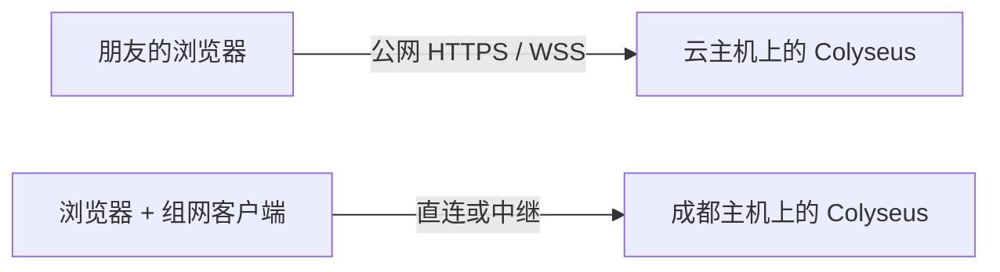
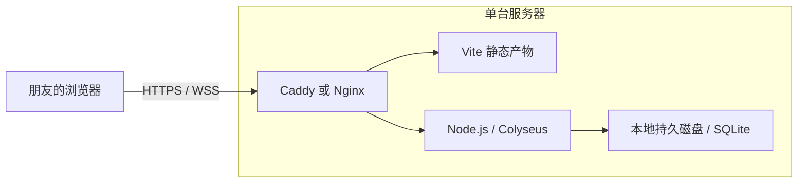

# 5. 部署方案选型：云服务器、个人电脑与 P2P

分析日期：2026-09-28。适用范围：面向中国大陆朋友的 5–11 人约局，沿用当前 React / Vite、Colyseus 和 SQLite 架构。架构事实见 [架构与技术现状](1_架构与技术现状.md)，本地命令见 [开发与验证](3_开发与验证.md)。

## 1. 推荐结论

**保留现有 Colyseus 权威服务端。先用成都闲置主机验证朋友局；长期需要「发网址就能玩」时，租一台小云服务器，前后端同机部署。当前不建议改写为浏览器原生 WebRTC P2P。**

已有主机配置为 i7-13650HX、4060 Ti、24 GB DDR5、2 TB 存储。当前游戏只处理投票、选牌和状态同步，不需要服务端图形渲染，显卡基本用不上。硬件充裕，决策重点是加入是否方便、网络稳定性、开服操作和断线恢复。

| 使用条件 | 推荐方式 |
| --- | --- |
| 固定朋友、约好时间玩、愿意安装组网软件 | 成都主机按需开服 + 虚拟组网 |
| 多数人用手机、只愿意打开网页、经常临时换玩家 | 单台云服务器 |
| 自己不在线时，朋友也要能开局 | 独立常驻服务器 |
| 想短期分享网址，但暂不租云主机 | 可测试个人电脑 + 支持 WSS 的公网隧道 |
| 想省服务器费而改成浏览器原生 P2P | 不推荐，开发和维护成本高于当前收益 |

这是一项条件化建议，不能简化成「家用电脑不适合开服」或「香港服务器一定最好」。约局开服只需要在牌局期间保持主机运行，不要求全天开机，也不以购买 UPS 为前提。

## 2. 先区分部署位置和 P2P

个人电脑开服不等于修改游戏协议。Tailscale / ZeroTier 等工具负责网络连通，现有浏览器仍通过 WebSocket 连接 Node.js 服务。



以上两种方式都保留中心权威架构。浏览器原生 P2P 则使用 WebRTC 等不同传输方式，需要重新处理连接建立、房主职责和状态同步。

| 方案 | 朋友怎么加入 | 对现有代码的影响 | 主要成本或限制 |
| --- | --- | --- | --- |
| 云服务器运行整套项目 | 浏览器打开网址 | 小，补部署配置 | 固定租金、系统维护和备份 |
| 个人电脑 + 虚拟组网 | 安装软件、接受邀请，再打开网页 | 小，保留 Colyseus | 安装授权、打洞、中继线路 |
| 个人电脑 + 公网隧道 | 浏览器打开网址 | 小，配置 HTTPS/WSS 入口 | 主机和隧道服务两端都要可用 |
| 浏览器原生 WebRTC P2P | 理想情况下只打开网页 | 大，重写网络层和房主接管 | 信令、中继、秘密信息保护、浏览器生命周期 |

## 3. 个人电脑按需开服

### 适用条件

固定朋友愿意安装一次组网软件，大多使用电脑，能够接受首次连接由主机维护者协助；主机在牌局期间保持运行，暂停休眠、自动重启和可能影响上行的后台任务。如果主机不在身边，还要有可行的开机方式。

首次安装和配置后，每次只需启动固定版本的游戏服务，结束后关闭；不需要每次重新安装依赖或部署项目。按需开服与常驻服务是两种使用模式，不应把全年在线的运维要求直接套到周末约局。

### 公网地址与打洞

公网 IPv4 不是虚拟组网的必要条件。Tailscale 会尝试 NAT 穿透，直连失败时使用中继。CGNAT 会影响直接入站访问，但不等于所有组网或反向隧道都不可用。

实际链路需要从朋友的网络验证：

- 用 `tailscale status` 查看连接是 `direct` 还是 `relay`。
- 用 `tailscale ping <主机名>` 辅助查看连接路径和延迟。
- 同时验证网页加入、选牌、断线恢复，不能只以 ping 成功作为验收。

中继可能位于境外，因此「游戏主机在成都」不保证实际数据路径始终在国内。路由器 WAN 地址与查询到的公网地址不一致，也可能是家庭双重 NAT，不能只凭这一项断言一定是运营商 CGNAT。

### 人数与加入体验

截至分析日期，Tailscale Personal 官方定价为同一 tailnet 最多 6 位用户，不能直接假定 11 人都能加入同一个免费网络。官方另有向外部用户分享单台机器的机制，可评估此方式及其访问策略；这不等于 11 人局必然需要付费。

ZeroTier 等替代方案也应核对当时的用户、设备额度和客户端支持，不把不同产品的免费额度混为一谈。主要使用手机的朋友还需考虑安装、登录和 VPN 配置的操作成本。

组网访问权限宜限定到游戏主机和必要端口，不需要给朋友开放整个家庭网络。

## 4. 云服务器：为加入方便和运行独立性付费

云服务器的主要收益是：朋友通过固定网址加入，运行不依赖维护者电脑开关机，也不受家庭路由器和家庭供电影响。它仍需要维护系统、证书、备份和发布流程，不能等同于无需运维。

推荐部署结构：



`2 核 2 GB` 可以作为试跑起点；需要在服务器上安装依赖和构建时，`4 GB` 更宽裕。这是配置建议，尚未通过容量压测验证能够同时承载多少房间。

当前没有必要为单个朋友局拆分 Vercel、游戏服务器和独立数据库。单机同时承载前端、后端和事件存储，可以减少跨平台配置与排障环节。

### 地域选择

| 地域 | 优点 | 需要验证的条件 |
| --- | --- | --- |
| 中国大陆 | 通常减少大陆玩家的跨境网络不确定性 | 公网托管的 ICP 备案、接入商对游戏类内容和主体资质的要求 |
| 中国香港 | 无需办理大陆节点的 ICP 备案环节 | 大陆不同运营商到具体套餐的实际线路，尤其是晚高峰 |
| 其他境外地域 | 托管平台和产品选择较多 | 首屏访问、WSS 建连、延迟波动和中继路径 |

香港不是稳定性的保证。腾讯云价格文档明确说明，其香港入门型套餐无法保障大陆与香港之间的跨境公网质量。不能只凭「香港」「BGP」「CN2」等标签代替目标玩家实测，也不能把这一套餐的说明推广为所有香港产品都不可用。

前端与后端分开部署时，玩家分别访问两者，游戏消息通常由浏览器直接发往后端。不能简单理解为每次操作都会依次经过 Vercel 和 Railway；同机部署的收益主要是减少独立的访问与维护环节。

## 5. 个人电脑 + 公网隧道

公网隧道能让朋友只用浏览器加入，同时不要求家庭网络具备公网 IPv4：

```text
朋友浏览器 → 公网 HTTPS/WSS 入口 → 隧道 → 成都主机
```

这是中继访问，不是浏览器之间的直接 P2P。以 Cloudflare Tunnel 为例，主机主动建立出站连接，Cloudflare 支持 WebSocket 代理；具体到大陆朋友的访问质量仍需测试，平台重启和空闲超时也可能终止连接。

如果采用 FRP 或类似方案，需要区分具体模式是否要求朋友安装客户端，以及入口是否支持浏览器使用的 HTTPS/WSS。入口稳定不代表家庭主机和家庭宽带也稳定。

**如果已经要租云主机做中继，对于当前低计算负载的游戏，通常直接把游戏部署到这台云主机更简单。** 仅在已有中继资源、还有其他家庭服务需要暴露，或存在必须使用本地主机的需求时，再考虑长期采用隧道。

家庭公网直连还需要单独确认地址、路由器转发、防火墙、运营商限制和接入要求；IPv6 直连需要验证所有实际玩家的网络支持，不能仅凭主机有 IPv6 就认为所有朋友都能访问。

## 6. 为什么暂不选择浏览器原生 P2P

当前客户端使用 Colyseus SDK 和 WebSocket，没有 WebRTC 传输实现。WebRTC 通常仍需要信令通道交换连接信息，并准备 STUN / TURN 应对不同网络；不能把它理解成彻底没有服务器。

游戏本身还存在以下约束：

- **隐藏信息**：如果所有客户端复制完整 `GameState`，阵营、手牌和牌堆都会暴露。中心权威与逐玩家投射必须继续保留，或改用复杂得多的协议。
- **房主信任**：若由一名玩家承担权威房主，仍需信任其持有完整状态。自己管理的云服务器和家用服务器管理员也具有相近的信任边界，搬到云上不会自动消除管理员查看秘密的能力。
- **房主迁移**：主机离开后，其他玩家既要接管状态，又要避免提前获得他人秘密；当前项目没有这套机制。
- **浏览器生命周期**：关闭标签页、手机切后台、浏览器挂起都会影响以浏览器为宿主的服务。独立 Node.js 服务可以在浏览器关闭后继续运行。

为节省小云主机租金而增加这些开发与维护任务，当前收益不足。虚拟组网已经可以解决「把现有服务端放在个人电脑上」的需求。

## 7. 成本对照

### 现金成本

以下功耗计算是示例，**不是对成都主机的实测**。假设整机平均功率 `100 W`，电价 `0.6 元/kWh`：

`月电费 = 功率（W）÷ 1000 × 开机小时数 × 电价（元/kWh）`

| 场景 | 假设或官方标价 | 月成本 |
| --- | --- | --- |
| 个人电脑按需开服 | 每月 8 次，每次 3 小时，共 24 小时 | 示例电费约 1.44 元 |
| 个人电脑全天运行 | 每月按 720 小时计算 | 示例电费约 43.2 元 |
| 大陆轻量云主机 | 腾讯云 2 核 2 GB、40 GB SSD、2 Mbps、100 GB 月流量入门套餐 | 标价 35 元起 |
| 香港轻量云主机 | 腾讯云 2 核 2 GB、40 GB SSD、20 Mbps 峰值、512 GB 月流量入门套餐 | 标价 38 元，有跨境质量提示 |

价格依据 2026-09-28 查阅的官方价格表，仅作量级参考，实际以下单页、地域、资格和续费条件为准。云端还要考虑域名、备份和超额流量；家用方案可能另有组网或中继费用。已有硬件的采购成本不应再次全部计入这次开服决策。

### 时间成本

若 8 位玩家每次等待排障 15 分钟，一次就消耗 `8 × 15 ÷ 60 = 2 人小时`。对固定朋友局，电费往往很低；如果每次都要处理安装、登录或无法直连，累计时间成本可能超过服务器租金。

比较成本时应使用实际开机时间，不把按需开服按全年运行计费；购买云套餐时则要看完整续费周期，不只比较首购优惠。

## 8. 无论放在哪里，都存在的恢复边界

现有实现支持在房间仍存活、凭据有效时恢复网络连接。**服务端进程重启后，当前不能恢复原房间、会话和牌局。**

SQLite / JSONL 保存事件并不等于已经实现房间恢复。家庭关机、系统重启，以及云端发布、崩溃重启，都可能使进行中的牌局失效。单纯更换部署地域不能解决这个问题。

其他工程要求：

- 当前按单实例部署，不直接复制进程做多副本。
- 保留事件存储的持久目录；数据库备份包含私密信息。
- 如果 SQLite 初始化失败并降级为 JSONL，应明确识别存储模式，不能把降级当成 SQLite 已验收。
- 生产或固定约局使用构建产物，避免服务端开发模式的文件监听触发意外重启。
- 保持访问入口稳定。当前身份保存在浏览器 storage 中，变化的域名、协议或端口会改变存储 origin，影响自动找回原身份。
- 公网部署配置 HTTPS/WSS；`VITE_SERVER_URL` 当前是构建时变量，变化后需要重新构建前端。默认的同主机 `2567` 端口不能直接当成统一 `443` 入口。

后续投入优先级应是可重复部署、稳定入口、房间与会话持久化恢复，再考虑更复杂的通信架构。统一部署包和一键启动是建议补充的能力，当前尚未交付通用 Docker/Caddy 部署包。

## 9. 实测后再决定购买

### 第一阶段：成都主机试跑

1. 首次配置固定版本服务与虚拟组网，先邀请两位不同网络的朋友验证连接。
2. 核对全员需要安装什么、使用什么设备，以及 11 人场景是否满足组网方案的额度与共享条件。
3. 在实际约局时段完成一到两局，记录下表。
4. 人为断开一位玩家网络后恢复，检查身份和当前阶段是否保持；进程重启测试放在测试局中，预期当前版本会丢失房间。

| 观察项 | 记录内容 |
| --- | --- |
| 加入门槛 | 首次安装 / 登录耗时；后续开局是否还需要协助 |
| 网络路径 | 城市、运营商、电脑或手机、直连或中继 |
| 实际交互 | 创建房间、加入、握拳、选牌能否正常进行 |
| 连续稳定性 | 完整牌局或至少 30–60 分钟内的断线次数、恢复耗时 |
| 主机状态 | 是否发生休眠、自动更新、上行拥塞 |
| 实际成本 | 开机时长、可测量的整机功耗、组网或中继费用 |

这些是验收建议，尚未在成都主机和朋友网络上执行。已有本地多人测试不能替代跨地区实测。

### 第二阶段：按结果选择

如果全员能顺利加入、后续无需反复排障、只在约好时间玩，继续使用个人电脑开服即可。

出现以下任一情况时，建议转为小云主机：

- 朋友主要使用手机或明确不愿安装组网客户端。
- 经常邀请新玩家，希望分享固定网址即加入。
- 自己不在线时，朋友仍需要开房。
- 连续两次因组网问题耽误开局。
- 为了中继已经在持续支付云服务器费用。

云服务器也应先短期验证，不因地域或线路营销标签直接购买长期套餐。选定个人电脑或云端只改变运行位置与连接方式；保持现有 Colyseus 架构，可以减少后续迁移成本。

## 10. 资料来源

以下官方资料查阅于 2026-09-28：

1. [Tailscale 连接类型](https://tailscale.com/kb/1257/connection-types)：直连、NAT 穿透、中继及路径检查。
2. [Tailscale 定价](https://tailscale.com/pricing)：Personal 用户额度与套餐条件。
3. [Tailscale 设备分享](https://tailscale.com/kb/1084/sharing)：向外部用户分享单台机器和访问权限。
4. [腾讯云轻量应用服务器价格总览](https://cloud.tencent.com/document/product/1207/73452)：大陆 / 香港套餐价格及跨境质量说明。
5. [Cloudflare Tunnel](https://developers.cloudflare.com/tunnel/)：出站隧道与公网入口。
6. [Cloudflare WebSocket 支持](https://developers.cloudflare.com/network/websockets/)：支持范围、连接中断和超时说明。
7. [WebRTC Peer Connections](https://webrtc.org/getting-started/peer-connections)：信令、ICE、STUN / TURN。
8. [阿里云通用网站 ICP 备案说明](https://help.aliyun.com/zh/icp-filing/basic-icp-service/product-overview/icp-filing-requirements-for-a-regular-website)：大陆公网托管的接入要求。

[Vercel 部署](4_Vercel部署.md) 保留为选择 Vercel + Railway 时的操作说明，不代表它是大陆朋友局的默认推荐。
